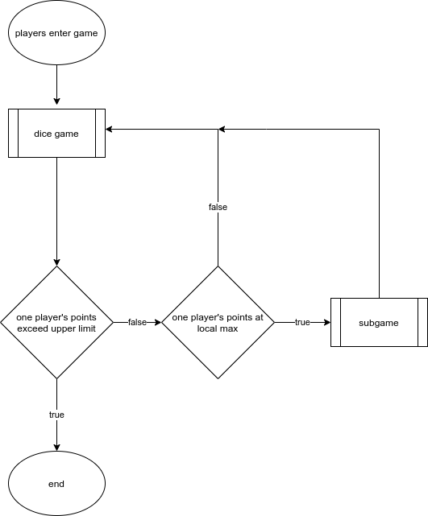

# Load On Dice Game

* [Rule](##Rule)
* [Usage](##Usage)
* [Single Player Mode](##Single Player Mode)

## General Description

This project will be stored and maintained in a GitHub private repository for now. We might make the repository public and open-source under MIT License (or other) depending on condition and contributors' agreement. Vision control will be done with git and managed by Ethan. There will be a general interface, or a middle layer, between the back-end classes and the GUI so that the same GUI program will run with different dice game (reach component) only depending on parameter passing and function calling. Settings and history (reach component) will be in JSON format, and data will be stored as CSV files. During the game, the opponent’s score will be hidden.

### Members

* **Team Name**: Dice Game Group 6
* **Ethan He**: back-end developer who designs interface and abstraction. Also responsible for  functions under all the general abstract classes and data storage management. He will accompany one other contributor to write up the documentations.
* **Jingqiu Huang**
* **Xuan Huang**:  programmer who develops game code and structure, also deals with group coordination.
* Yangqing Zhang (not responding)

### Video

When the whole game’s code is finished and run as desired, we will hold a zoom meeting in the group to record the final video, which will mainly include two parts. First of all, we will introduce our whole project, from the initial idea to the final result we get. We will explain every group member’s contribution, the dilemma we faced, and how we overcome those difficulties in detail. In the second part of the video, we will run a demo to show the whole process of the game we designed and how it works. In the end, the video will be both uploaded to YouTube and submitted to Canvas as part of the project work.

## Project Description

We aim to design a highly diverse game for two players synchronously. This game is a competition intended. Two players will play in a dice game based on the given rule. This dice game of choice will be the main game for players to get their points. For each round, the winner will gain points whereas the loser will lose points. The game ends when one of the users reaches the maximum. When the player's point accumulated to a "peak" point, both players will enter the "subgame" mode. A subgame will be a single-player game that is short but interesting, for example, Minesweeper. If the player passes his subgame, he will gain points. If they lose, their points might be taken off.

This general game flow will be as following



### Reach \& Special Features

* 2-3 simple dice game for users to choose.
* 3 subgames with variable difficulty level.
* Gaming history for users to check.
* If playing with the same people again, the players can choose to continue where they left off (if the game is not finished last time and is saved).
* Pause function that will tell the other player to take a break.

## Rule

For each round, each round, both players roll their 5 dice. The 5 new rolled dice (as numerical array) will be **loaded on** the player's record stack, and the record stack will be calculated for points of this round.

1. After rolled, a random die of this 5 dice will be added by a random number.
2. the points get in this round is the length of the longest strictly increasing subsequence (`src/lengthLIS.m`).
3. The player who has the higher points in this round, the points they get in this round will be added to their total score. The other player gets nothing for this round.

### Subgame

* The play will enter the subgame (minesweeper) when their score is a multiple of 10, the other player will be waiting.
* If the player **solve** the minesweeper subgame, his total score will be ==added by 14==.
* If the player **fail to solve** the minesweeper, his total score will be ==subtracted by 33==, and the history stack will be clear (i.e. lost all previous record).

## Usage

First, enter MATLAB.
```bash
matlab              # if your wish to enter MATLAB IDE
matlab -nodesktop   # just to use the matlab interpreter
```

Then, in MATLAB environment (IDE or command line interpreter), do one of the following:

```matlab
run('Load_On_GUI.m')	% run the GUI version of this game
run('Load_On_CLI.m')	% run the CLI version of this game, currently not supported
```

## Single Player Mode

Since the server communication part does not work perfectly (the contributor of this part Ethan He has been busy for other subject recently), we also have a single player mode ready. In the Single player mode, the second player will be an AI, and the rule will be the same. This AI implication is to show that all other parts expect ThingSpeak are working.

**How to access the Single Player Mode**

```bash
git checkout SinglePlayerMode
```

The step after this is the same as multi-player mode.


